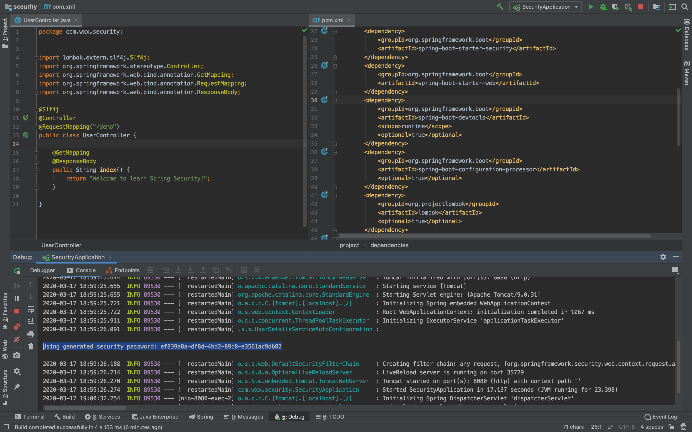

今天试了下Spring Boot 2.0, 发现以下两个包找不到了：

compile('org.springframework.security:spring-security-jwt')
compile('org.springframework.security.oauth:spring-security-oauth2')

在 start.spring.io里输入 Oauth2 时，发现已经不能单独选spring-security-oauth2了，只能选择更加 high level的 spring-cloud-starter-oauth2 ，
可见Spring默认推荐使用 spring-cloud-starter-oauth2，它比spring-security-oauth2多了哪些功能呢？要是能把代码更新到 Spring Boot 2.0 就更好了


```xml
<dependency>
            <groupId>org.springframework.boot</groupId>
            <artifactId>spring-boot-starter-security</artifactId>
        </dependency>
        <dependency>
            <groupId>org.springframework.boot</groupId>
            <artifactId>spring-boot-starter-web</artifactId>
        </dependency>
        <dependency>
            <groupId>org.springframework.boot</groupId>
            <artifactId>spring-boot-devtools</artifactId>
            <scope>runtime</scope>
            <optional>true</optional>
        </dependency>
        <dependency>
            <groupId>org.springframework.boot</groupId>
            <artifactId>spring-boot-configuration-processor</artifactId>
            <optional>true</optional>
        </dependency>
        <dependency>
            <groupId>org.projectlombok</groupId>
            <artifactId>lombok</artifactId>
            <optional>true</optional>
        </dependency>
        <dependency>
            <groupId>org.springframework.boot</groupId>
            <artifactId>spring-boot-starter-test</artifactId>
            <scope>test</scope>
            <exclusions>
                <exclusion>
                    <groupId>org.junit.vintage</groupId>
                    <artifactId>junit-vintage-engine</artifactId>
                </exclusion>
            </exclusions>
        </dependency>
        <dependency>
            <groupId>org.springframework.security</groupId>
            <artifactId>spring-security-test</artifactId>
            <scope>test</scope>
        </dependency>
```
Spring Boot 项目引入了 Spring Security 以后，自动装配了 Spring Security 的环境，
Spring Security 的默认配置是要求经过了 HTTP Basic 认证成功后才可以访问到 URL 对应的资源，且默认的用户名是 user，密码则是一串 UUID 字符串，
输出到了控制台日志里，如下图所示：
默认的用户名是 user，密码则是一串UUID字符串:Using generated security password: ef839a8a-df8d-4bd2-89c8-e3561ac9db82




封装顺序是这样的：spring security及其各个模块=》spring cloud security=》spring boot autoconfigure的security部分，比如autoconfigure模块有个spring security的sso，是对spring security在oath2下的封装，
spring oauth2 authorizeserver，resourceserver，认证服务器和资源服务器是怎么交互的，token_key,/oauth/token/ refresh/token，resourceserver就是业务系统，oauth client 就是边缘业务系统，比如直接面向用户的UI系统，或者UI系统直接调用的API接口这一层；
JWT和OAuth2的区别？看到好多人在比较这两个东西，现在终结这个问题：JWT只是OAuth2中的token的一种类型。
jwt client（Resource Server或者Zuul等），使用jwt的业务系统在解码acces_token的时候，需要一个toke_key，这个token-key就是JWT Client应用启动的时候从Auth Server拉取的，接口是token/token_key
单点登录这种功能，好多javaee容器都自带的，像websphere
spring Security完全将认证和授权分开了，资源只需要声明自己是需要认证的，需要什么样的权限，只管跟当前用户要access_token。授权的四种方式任意，只要拿到token就可以去让资源去认证。
边缘服务器需要开启@EnableOAuth2Sso，但是边缘服务器也是一个ResourceServer，边缘服务器如果是zuul的话，就不是一个ResourceServer了，只需要添加@EnableOAuth2Sso注解就可以了；
client_credentials模式下spring boot不会帮助spring Security构建ClientCredentialsResourceDetails 对象，需要开发者自己创建
favicon.icon，记得把这个东西过滤掉，奶奶的
在其中一个边缘服务上，您可能需要启用单点登录。 @EnableOAuthSso，只需要在边缘服务器指定没用来引导未登录的用户登录系统。@EnableOAuthSso将允许您将未经认证的用户的自动重定向转向授权服务器，他们将能够登录
EnableOAuth2Client，在中间中继的时候用
ClientCredentialsTokenEndpointFilter，AS设置了allowFormAuthenticationForClients才会有，详情看这里面的AuthorizationServerSecurityConfigurer#configure(HttpSecurity http)逻辑，这点非常重要，ClientCredentialsTokenEndpointFilter是用来验证clientid和client_secret的，使用clientid和client_secret换取下一步的东西；
TokenGranter，AuthorizationCodeTokenGranter，ClientCredentialsTokenGranter，RefreshTokenGranter，ImplicitTokenGranter，ResourceOwnerPasswordTokenGranter
TokenServices分为两类，一个是用在AuthenticationServer端，AuthorizationServerTokenServices，ResourceServer端有自己的tokenServices接口，
BearerTokenExtractor，从其可以看出，token的获取顺序，Header，parameters（get/post）
spring security 保护自己的配置，作为ResourceServer的权限配置和作为AuthorizationServer的配置都是在不同的地方
An OAuth 2 authentication token can contain two authentications: one for the client(OAuth2 Client) and one for the user. Since some OAuth authorization grants don’t require user authentication, the user authentication may be null.
jwt是不需要存储access_toen的，jwt的机制就是将所有的信息都存在了token里面，从JwtTokenStore也可以看出来
OAuth2AuthenticationManager是密切与token认证相关的，而不是与获取token密切相关的。这是真正认证的地方，一会重点debug，resourceIds
每一个ResourceServer在配置的时候，ResourceServerConfiguration，需要配置一个resourceID，一个ResourceServer只能配置一个
oauth/token = 先验证的是clientid和clientsecret，接着在验证username和userpassword，都是用的ProvideManager，两次验证是两个不同的请求，oauth2客户端会使用RestTemplate请求服务器的接口
ClientCredentialsTokenEndpointFilter用来验证clientId和clientsecret的：
OAuth2ClientAuthenticationProcessingFilter：OAuth2客户端用来从OAuth2认证服务器获取access token，也可以从OAuth2认证服务器加载authentication对象到OAuth2客户端的SecurityContext对象中；里面调用OAuth2AuthenticationManager#authenticate（）方法使用DefaultTokenServices ，DefaultTokenServices 使用JwtTokenStore，JwtTokenStore使用JwtAccessTokenConverter来将JWT解密成Auth对象。 来从AuthServer请求授权信息
accessToken被解密成如下的JWT对象：
{“alg”:”RS256”,”typ”:”JWT”} {“exp”:1503758022,”user_name”:”admin”,”authorities”:[“ROLE_TRUSTED_CLIENT”,”ROLE_ADMIN”,”ROLE_USER”],”jti”:”d56f43d2-6c4a-46cf-85f3-050ee195a2bd”,”client_id”:”confidential”,”scope”:[“read”]} [128 crypto bytes]
AbstractSecurityInterceptor#befroeInvaction 是ResourceServer获取认证信息的地方
只要是需要验证token有效性的都需要jwt.key-uri的配置
AffirmativeBased值得debug