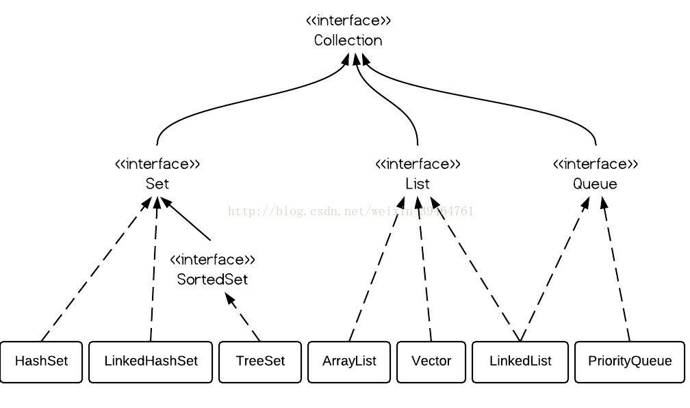
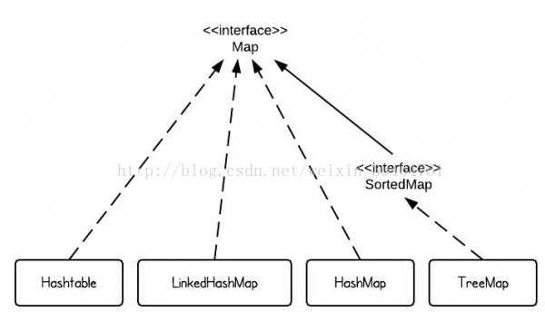
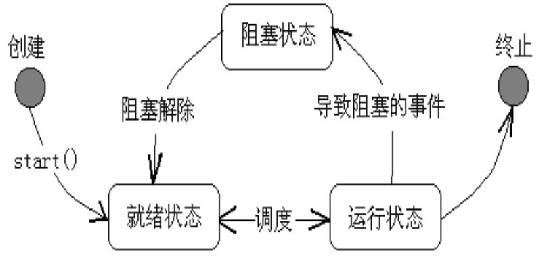
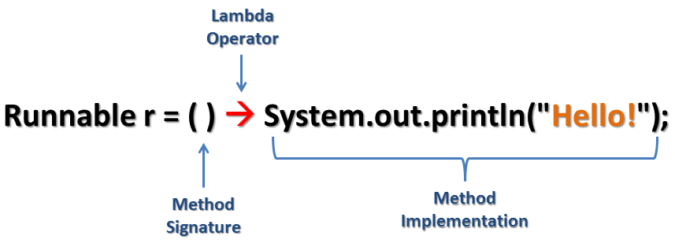

# Java share

## 1.数据结构
Java里面将数据类型分为两种：`基本类型` 和 `引用类型`。

基本类型：不能简化的、内置的数据类型、由编程语言本身定义，它表示了真实的数字、字符和整数，直接存储在内存中的内存栈上的，数据本身的值就是存储在栈空间里面。     
引用类型：数据类型一般都是通过类或接口进行构造，类提供了捆绑数据和方法的方式，同时可以针对程序外部进行信息隐藏，存储在有序的内存栈上的，而对象本身的值存储在内存堆上的。     


基本类型8种:`char`、`boolean`、`byte`、`short`、`int`、`long`、`float`、`double`   
引用类型5种：`类`、`接口`、`数组`、`枚举`、`标注`   

不同数据类型使用场景:   
根据初始值，是否有交互等因素决定使用什么类型；   
基本类型：值确定，无null   
引用类型：集合中，对外交互有null的情况   

#### 1.1.2 接口&抽象类
    
Java中的抽象是为了更稳定：   
抽象类表示一个模板，接口表示一个契约。   
模板填写之后才会有意义，契约需要遵守。   
抽象类和接口类的实例化，通过多态性（向上转型，向下转型），所调用的全部方法，都是被覆写过的方法。   

#### 1.1.3 枚举
枚举是一种特殊类型的数据使得其能够成为一个变量，值是一组预定义的常量，变量值必须等于为其预定义的值之一。   
常见示例包括方向（NORTH，SOUTH，EAST和WEST的值）和星期几。   
因为它们是常量，所以枚举类型字段的名称是大写字母。   

```java
public enum Day {
    SUNDAY, MONDAY, TUESDAY, WEDNESDAY,
    THURSDAY, FRIDAY, SATURDAY 
}
```


## 2 数据集合 
### 2.1 Collection


|List接口主要实现| 数据结构| 线程安全|其他特性|
| ------ | ------ | ------ | ------ | 
|Vector| 数组 | 线程安全|增删和查询都很慢|
|Stack| 数组 | 线程安全|后进先出|
|ArrayList|数组| 线程不安全|查询速度快|
|LinkedList| 链表 | 线程不安全|增删元素的速度很快|


|Set接口主要实现|数据结构| 线程安全|其他特性|
| ------ | ------ | ------ | ------ | 
HashSet|哈希表|线程不安全|查询速度最快集合
LinkedHashSet|链表|线程不安全|线程不安全
TreeSet|树|线程不安全|有序的
EnumSet|不确定|线程不安全|枚举的专用Set


### 2.2 map


|Map主要实现|数据结构|有序|线程安全|父类|其他特性|
| ------ | ------ | ------ | ------ | ------ | ------ |
|HashMap| 哈希表  |随机存储| 线程不安全|AbstractMap|访问速度快|
|LinkedHashMap|链表  |有序存储| 线程安全|HashMap|遍历比HashMap慢|
|Hashtable| 哈希表 | 随机存储|线程安全|HashMap|写入较慢|
|TreeMap  | 树|有序存储|线程不安全|AbstractMap|默认是按键值的升序排序，指定排序的比较器|

### 2.3 使用

1.存储数据   
2.遍历   
3.排序   

### 2.4 总结

>HashSet,TreeSet一个无序，一个有序；
HashMap,LinkedHasmMap,一个无序，一个有序；
Vector和HashTable，Stack是线程安全的，但是效率低；
线程不安全的类都可以配合Collections得到线程安全的类。

>ArrayList , LinkedList , Vector
ArrayList和Vector本质都是用数组实现的，而LinkList是用双链表实现的；所以，Arraylist和Vector在查找效率上比较高，增删效率比较低；LinkedList则正好相反。
ArrayList是线程不安全的，Vector是线程安全的，效率肯定没有ArrayList高了。实际中一般也不怎么用Vector,可以自己做线程同步，也可以用Collections配合ArrayList实现线程同步。
前面多次提到扩容的代价很高，所以如果能确定容量的大致范围就可以在创建实例的时候指定，注意，这个仅限于ArrayList和Vector。


变量的比较：   
==比较的是引用地址，而不是比较实际的值


## 3 线程



```java

public class RunnableImpl implements Runnable {
    public void run() {
        Thread.currentThread().setName("Runnable's implemention");
        for (int i = 0; i < 10; i++)
            System.out.println(Thread.currentThread().getName() + "------------");
    }
}

Thread thread = new Thread(RunnableImpl);
thread.start();

```
线程相关：
`Thread    
Runnable   
Callable   
Future   
FutureTask  
Semaphore   
CountDownLatch   
CompletableFuture`   
 

#### 1.4.1 线程启动
调用run()会在当前线程执行；
调用start()会启一个新的线程执行;
#### 1.4.2 线程安全
在多线程下保证线程按正确的顺序执行，得到正确的结果。
#### 1.4.3 锁
synchronized   
Lock   
#### 1.4.4 线程间通信
Object.wait();   
Object.notify();   

#### 1.4.5 常见线程池
Executors.newCacheThreadPool() : 缓存线程池   
Executors.newFixedThreadPool(int n) :    指定的线程数的线程池   
Executors.newScheduledThreadPool(int n)  :  带有调度功能的线程池   
Executors.newSingleThreadExecutor()  :  单线程线程池   


## 4 Java8
1. Java8 接口新特性   
2. Java8 Lambda表达式   
3. Java8 方法引用      
4. Java8 Stream & Parallel Stream     
5. Java8 Optional     
6. Java8 DateTime     
7. Java8 Lambda 与 枚举 结合使用    


**接口新特性:**   
接口改动一下就要修改对应的实现类，为了兼容老接口，Java8新增了默认方法和静态方法；   
函数式接口(Functional Interface)是只有一个抽象方法的接口。   

    函数式接口中的抽象函数就是为了支持 lambda表达式；
    函数式接口可以被隐式转换为lambda表达式；
    为确保函数式接口符合语法，可以添加@FunctionalInterface注解；

_包路径：java.util.function_


**Lambda表达式:**   


```java
// 没有参数
() -> { System.out.println("No argument"); }
// 一个参数
(int i) -> { System.out.println("Single integer argument : " + i); }
// 多个参数
( int x, String y ) -> { System.out.println("Two arguments : " + x + " and " + y); }
```

**Lambda表达式的用处:**   
1) 替代匿名类简化代码
2) 作为参数传递增强灵活性
3) 结合stream对集合进行串行或并行的聚合操作


 


## 3 常用工具类
org.apache.commons.lang3.StringUtils   
1、isBlank 字符串是否为空 (trim后判断)   
2、isEmpty 字符串是否为空 (不trim并判断)   
3、equals 字符串是否相等   

org.springframework.util.StringUtils   
1、isEmpty 检测字符串是否为空（若传入为对象，则判断对象是否为null）   

org.apache.commons.beanutils.PropertyUtils   
1、getProperty 获取对象属性值   
2、setProperty 设置对象属性值   
3、copyProperties 复制属性值，从一个对象到另一个对象   

org.apache.commons.collections.CollectionUtils   
1、isEmpty 是否为空   
2、isEqualCollection 判断两个集合是否一致   

## 4.调试方法

打断点方法：   
1.根据错误信息，打断点一步一步排查    
2.定位变量，核查变量的值(鼠标放上去或alt+变量)   

调试方法：   
F7:进入方法    
F8:下一步    
F9:下一个断点   

## 4.框架介绍
编译打包：
maven    
gradle    

JavaEE：   
Struts2      
spring + springMVC    
springBoot + web     

ORM：
Spring Data JPA /Hibernate   
Mybatis   

单元测试：
Junit   
Mocktio   
Spock   

## 5.命名
### 5.1 命名规范
1.  项目名全部小写
2.  包名全部小写
3.  类名首字母大写，如果类名由多个单词组成，每个单词的首字母都要大写
4.  变量名、方法名首字母小写，如果名称由多个单词组成，每个单词的首字母都要大写
5.  常量名全部大写

所有命名规则必须遵循以下规则：
- 名称只能由字母、数字、下划线、$符号组成   
- 不能以数字开头   
- 名称不能使用JAVA中的关键字   
- 坚决不允许出现中文及拼音命名   

### 5.2 注释规范   
1. 类注释： `在每个类前面必须加上类注释`   
2. 属性注释：`在每个属性前面必须加上属性注释`   
3. 方法注释：`在每个方法前面必须加上方法注释`   
4. 构造方法注释：`在每个构造方法前面必须加上注释`   
5. 方法内部注释：`在方法内部使用单行或者多行注释，该注释根据实际情况添加`   


### 5.3 对象的分类
常见的叫法：`Entity`、`JavaBean`、`Model`、`POJO`、`Domain`、`VO`、`BO`   
#### 5.3.1 按照 Spring MVC 分层结构划分   
1. `JavaBean`：表示层 （Presentation Layer）   
2. `Entity` |` Model` |` Domain`： 业务层 （Service layer）   
3. `DAO`： 数据访问层 （data access layer）   

> `Entity`、`Model`、`Domain`的不同：   
> 1.`Entity`字段必须和数据库字段一样   
> 2.`Model`前端需要什么我们就给什么   
> 3.`Domain`很少用，代表一个对象模块   

#### 5.3.2 按照业务划分  

> JavaBean: JavaBean是一种规范，即包含一组set和get方法的Java对象。   

1. `EJB(Enterprise JavaBean)`：我认为它是一组”功能”JavaBean的集合。上面说了JavaBean是实现了一种规范的Java对象。这里说EJB是一组JavaBean，的意思是这一组JavaBean组合起来实现了某个企业组的业务逻辑。这里的一组JavaBean不是乱组合的，它们要满足能实现某项业务功能的搭配。找个比方，对于一身穿着来说，包括一顶帽子，一件衣服，一条裤子，两只鞋,这穿着就是EJB。
2. `POJO`：普通的Java对象，对于属性一般实现了JavaBean的标准，另外还可以包含一些简单的业务逻辑(方法)。
-  2.1 ` PO`: POJO在持久层的体现，对POJO持久化后就成了PO，PO更多的是跟数据库设计层面相关，一般PO与数据表对应，一个PO就是对应数据表的一条记录。
-  2.2 `DAO`: PO持久化到数据库是要进行相关的数据库操作的(CRUQ)，这些对数据库操作的方法会统一放到一个Java对象中，这就是DAO。
-  2.3 `BO`：POJO在业务层的体现，对于业务操作来说，更多的是从业务上来包装对象，如一个Student的BO，可能包括name, age, score等，这些属性在数据库中可能会在多张表中，因为每一张表对应一个PO，而我们的BO需要这些PO组合起来(或说重新拼装)才能成为业务上的一个完整对象。
-  2.4  `VO(Value Object/View Object)`： POJO在表现层的体现，当我们处理完数据时，需要展现时，这时传递到表现层的POJO就成了VO。它就是为了展现数据时用的。
-  2.5 `DTO(Data Transfer Object)`：POJO在系统间传递，当我们需要在两个系统间传递数据时，一种方式就是将POJO序列化后传递，这个传递状态的POJO就是DTO。

