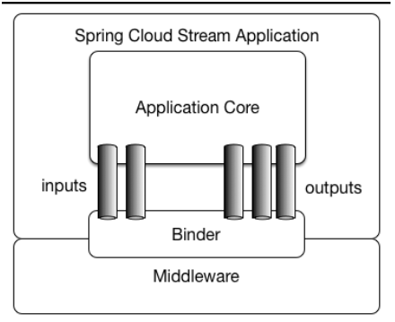

# Spring Cloud Stream


通过Spring Cloud Stream注入的输入和输出通道与外部世界通信。
通道通过专用的Binder实现与外部代理连接。

Spring Cloud Stream为Kafka和Rabbit MQ提供了Binder实现。   
Spring Cloud Stream自动探测并使用在classpath下找到的binder。   
你可以轻松地在相同的代码中使用不同类型的中间件：仅仅需要在构建时包含进不同的binder。   
在更加复杂的使用场景中，你也可以在应用中打包多个binder并让它自己选择binder，甚至在运行时为不同的通道使用不同的binder。   

 
## 1 应用程序模型

- Spring Cloud Stream的应用程序模型
- Binder抽象
- 持久的订阅-发布模型支持
- 消费者组支持
- 分区支持
- 可拔插的Binder API

## 2 绑定（Binder）

Spring Cloud Stream提供了一个Binder抽象，用于连接外部中间件的物理destination。
本节提供了有关Binder SPI主要概念、主要组件和实现特定细节的信息。

生产者是任何发送消息到通道的组件。通道可以通过某种代理的Binder实现来绑定到这种外部消息代理。当执行bindProducer()方法时，第一个参数是代理中destination的名称，第二个参数是生产者将向其发送消息的本地通道实例，第三个参数包含要在为该通道创建的适配器内使用的属性（如分区key表达式）。
消费者是从通道接收消息的组件。和生产者一样，消费者的通道可以绑定到外部消息代理。当执行bindConsumer()方法时候，第一个参数是destination名称，第二个参数提供了消费者逻辑组名称。每个代表消费者的组绑定到给定的destiantion，并收到生产者发送到该destination的每条消息的副本（即，发布 - 订阅语义）。

Spring Cloud Stream依赖于Binder SPI实现来执行连接通道到消息代理的任务。每个Binder实现通常连接到一种消息系统。

一个典型的binder实现包含以下内容：
- 一个实现Binder接口的类
- 一个Spring Configuration类，用于创建上述类型的bean以及中间件连接基础设施。
- 一个classpath上的META-INF/spring.binders文件夹，它包含一个或多个binder定义。


```properties
spring.cloud.stream.bindings.input.binder=kafka
spring.cloud.stream.bindings.output.binder=rabbit
```

## 3 编程模型
3.1. 声明和绑定通道
3.1.1 声明通道
```java
public interface Source {

    String OUTPUT = "userInvitationOutput";

    @Output("userInvitationOutput")
    MessageChannel output();
}
```

```java
public interface destination {

    String INPUT = "userInvitationInput";

    @Input("userInvitationInput")
    SubscribableChannel input();
}

```


3.1.2 通过@EnableBinding触发绑定

@EnableBinding注解接受一个或多个接口类作为参数，这些接口必须包含表示可绑定组件（通常为消息通道）的方法。
在@EnableBinding注解中使用Source接口作为参数会触发创建绑定通道的动作，分创建一个名为userInvitationOutput的绑定通道。

```java
@EnableBinding(Source.class)
public class CafeConfiguration {
    ...
}
```


对于每个绑定接口，Spring Cloud Stream会生成一个实现接口的bean。执行bean中的@Input或者@Output注解的方法会返回相关的绑定通道。

3.1.3 访问绑定通道
 
 ```java
@Component
public class SendingBean {

    private Source source;

    @Autowired
    public SendingBean(Source source) {
        this.source = source;
    }

    public void sayHello(String name) {
         source.output().send(MessageBuilder.withPayload(name).build());
    }
}

```

```java

@Override
    public <S extends T> S save(S entity) {
        entity = super.save(entity);
        if (repositoryOutput != null) {
            repositoryOutput.output().send(MessageBuilder
                    .withPayload(entity)
                    .setHeader("type", entity.getClass().getSimpleName())
                    .build());
            log.info("repositorSource send message: {}", entity);
        }
        return entity;
    }

```
## 4 生产和消费消息

@StreamListener注解在其他Spring Message注解（例如，@MessageMapping，@JmsListener，@RabbitListener等等）之后建模，
但是添加了内容类型管理和强制类型转换功能。
```java

@EnableBinding(Processor.class)
public class TransformProcessor {

  @Autowired
  VotingService votingService;

  @StreamListener(Processor.INPUT)
  @SendTo(Processor.OUTPUT)
  public VoteResult handle(Vote vote) {
    return votingService.record(vote);
  }
}

```
带分发条件的@StreamListener。   
在这个示例中，所有带有值为foo的type头的消息将被分发到receiveFoo方法，而所有带有值为bar的type头的消息会被分发到receiveBar方法。
```java

@EnableBinding(Sink.class)
@EnableAutoConfiguration
public static class TestPojoWithAnnotatedArguments {

    @StreamListener(target = Sink.INPUT, condition = "headers['type']=='foo'")
    public void receiveFoo(@Payload FooPojo fooPojo) {
       // handle the message
    }

    @StreamListener(target = Sink.INPUT, condition = "headers['type']=='bar'")
    public void receiveBar(@Payload BarPojo barPojo) {
       // handle the message
    }
}

```

## 5. 配置属性
### 5.1 Stream属性
### 5.1 Binder配置属性
### 5.2 生产者属性
### 5.3 消费者属性
