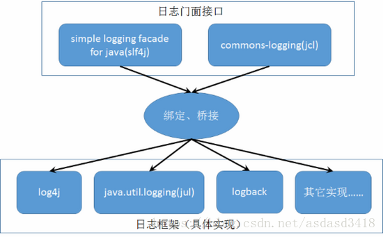
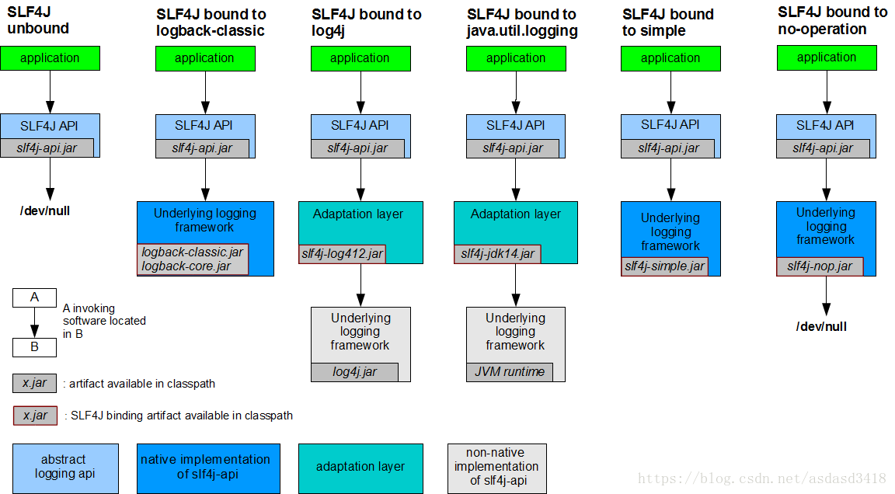
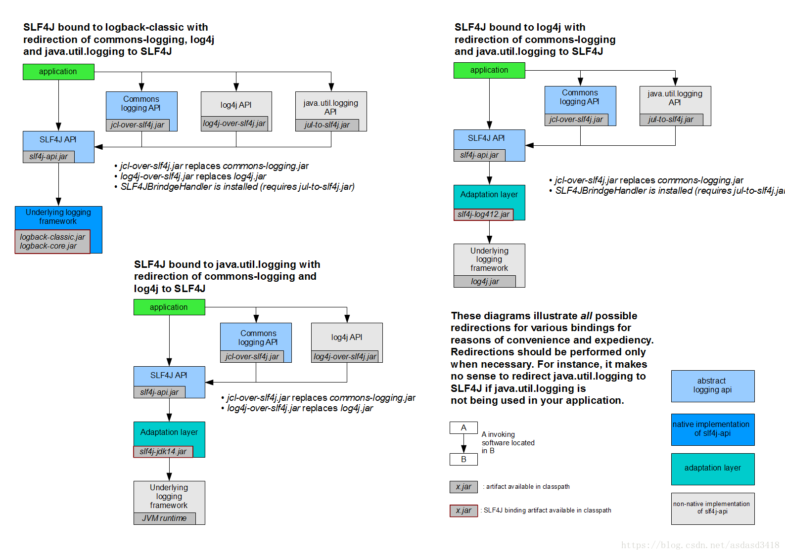

引言

对于j2ee 开发者来说，难免会引入各种框架，而当需要查看框架打印的日志的时候，你会发现每个框架引用的日志框架又不相同，
什么slf4j,logback,log4j… 头都大了，处理的一不小心，轻则日志打印不出来，重则项目起不来，甚至会造成内存泄露。
那么他们之间到底是什么关系呢？

java中的日志框架
上图可以大体概况java的日志框架结构，slf4j和jcl作为日志的门面，存在于最上层。我们可以将它们理解为java开发中的接口。
而log4j，jul，logback…则是这些接口的不同实现。
就拿slf4j这个“接口”来说，logback是直接基于它的具体实现，而log4j则不是，为了使log4j也能实现slf4j这个"接口"，
slf4j-log4j12出现了，slf4j-log4j12在slf4j和log4j中间起到了适配的作用，也就是我们经常说的桥接。
有了它，log4j也能符合slf4j规范了。

上图列出slf4j常见的日志实现以及桥接器。
通过slf4j-log4j12可以使调用者使用slf4j提供的api来打印日志，而日志的具体实现交由log4j来完成。
但是只是这样还不足以解决我们项目中的问题，假如我们的项目使用的是logback框架，引入的另一个jar包使用的是log4j框架，那么此时项目中就使用了两种日志框架，不免有些冗余，并且给项目带来了复杂性。此时log4j-over-slf4j 出现了，简单的说，它的作用就是讲引入的jar包中的log4j替换为log4j-over-slf4j，jar所有使用log4j打印日志的地方将会转换为slf4j打印日志。而slf4j实际调用的是logback来具体的打印日志。这样就可以将项目中的日志框架统一。
具体可以参看下图。

结语
需要注意的是，不能同时使用log4j-over-slf4j和log4j-log4j12，否则会产生死循环。同样的其他日志框架也类似。
在一个项目中，统一日志框架保持项目的简介性是很有必要的。
推荐使用logback作为slf4j的实现。
具体logback相较于log4j和其他日志框架的优点不再细说。
