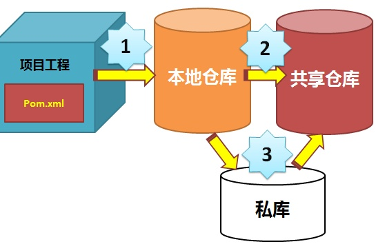

## 1 Maven 生命周期
maven生命周期（lifecycle）由各个阶段组成，每个阶段由maven的插件plugin来执行完成。
生命周期（lifecycle）主要包括
clean、
resources、
complie、
install、
pacakge、
testResources、
testCompile、
deploy等，
其中带test开头的都是用业编译测试代码或运行单元测试用例的。

构建的各个环节

    清理clean：将以前编译得到的旧文件class字节码文件删除
    编译compile：将java源程序编译成class字节码文件
    测试test：自动测试，自动调用junit程序
    报告report：测试程序执行的结果
    打包package：动态Web工程打War包，java工程打jar包
    安装install：Maven特定的概念-----将打包得到的文件复制到“仓库”中的指定位置
    部署deploy：将动态Web工程生成的war包复制到Servlet容器下，使其可以运行
    
> https://www.runoob.com/maven/maven-build-life-cycle.html   


## 2  区别

mvn clean package依次执行了clean、resources、compile、testResources、testCompile、test、jar(打包)等７个阶段。
mvn clean install依次执行了clean、resources、compile、testResources、testCompile、test、jar(打包)、install等8个阶段。
mvn clean deploy依次执行了clean、resources、compile、testResources、testCompile、test、jar(打包)、install、deploy等９个阶段。
由上面的分析可知主要区别如下，

package命令完成了项目编译、单元测试、打包功能，但没有把打好的可执行jar包（war包或其它形式的包）布署到本地maven仓库和远程maven私服仓库
install命令完成了项目编译、单元测试、打包功能，同时把打好的可执行jar包（war包或其它形式的包）布署到本地maven仓库，但没有布署到远程maven私服仓库
deploy命令完成了项目编译、单元测试、打包功能，同时把打好的可执行jar包（war包或其它形式的包）布署到本地maven仓库和远程maven私服仓库


## 3 Maven 快照(SNAPSHOT) 
> https://www.cnblogs.com/EasonJim/p/6852840.html

## 4 常用命令
mvn install -Dmaven.test.skip=true


## 5 聚合(modules标签)与继承(parent标签)的关系
1.聚合主要是为了方便快速构建项目，继承主要是为了消除重复配置；
2.对于聚合模块而言，它知道有哪些被聚合的模块，但那些被聚合的模块不知道这个聚合模块的存在；
对于继承的父pom而言，它不知道有哪些子模块继承它，但那些子模块都必须知道自己的父POM是什么；
3.聚合POM与继承中的父POM的packaging都必须是pom；同时，聚合模块与继承中的父模块除了POM外，都没有实际的内容


## 6 中央仓库配置
当构建一个Maven项目时，首先检查pom.xml文件以确定依赖包的下载位置，执行顺序如下：
1、从本地资源库中查找并获得依赖包，如果没有，执行第2步。 
2、从Maven默认中央仓库中查找并获得依赖包（http://repo1.maven.org/maven2/），如果没有，执行第3步。 
3、如果在pom.xml中定义了自定义的远程仓库，那么也会在这里的仓库中进行查找并获得依赖包，如果都没有找到，那么Maven就会抛出异常。



## 7 maven-wrapper
先来看看传统maven的使用流程

    传统使用maven需要先到官网上下载
    配置环境变量把mvn可执行文件路径加入到环境变量，以便之后使用直接使用mvn命令。
    另外项目pom.xml文件描述的依赖文件默认是下载在用户目录下的.m2文件下的repository目录下。
    再次，如果需要更换maven的版本，需要重新下载maven并替换环境变量path中的maven路径。

现在有了maven-wrapper，会获得以下特性

    执行mvnw比如mvnw clean ，如果本地没有匹配的maven版本，直接会去下载maven，放在用户目录下的.m2/wrapper中
    并且项目的依赖的jar包会直接放在项目目录下的repository目录，这样可以很清晰看到当前项目的依赖文件。
    如果需要更换maven的版本，只需要更改项目当前目录下.mvn/wrapper/maven-wrapper.properties的distributionUrl属性值，更换对应版本的maven下载地址。mvnw命令就会自动重新下载maven。
    可以说带有mvnw文件的项目，除了额外需要配置 java环境外，只需要使用本项目的mvnw脚本就可以完成编译，打包，发布等一系列操作。

maven wrapper可以自动下载maven，但实际上我们常用的idea软件都自带了maven。
且如果用上了idea，一般习惯也是直接使用Navigation Bar执行maven命令比较方便。
maven wrapper根据配置自动切换maven版本。这个看起来很有用，但实际上maven版本也是很稳定。很少会出现需要切换maven版本的情况
使用mvnw命令会在直接当前项目下生成repository，看起来每一个项目独立了repository，很模块化的样子。但是这样不仅浪费了磁盘空间，且实际上开发中并不关心repository，idea会自动有external librayies目录提供查看依赖的jar包。
当然，如果纯命令行工作，这会是个不错的选择。


## Maven名词解释

1. POM(Project Object Model)项目对象模型
Maven项目对象模型(POM)，可以通过一小段描述信息来管理项目的构建，报告和文档的软件项目管理工具。
POM 与 Java 代码实现了解耦，当需要升级版本时，只需要修改POM，而不需要更改Java代码，而在POM稳定后，日常的Java代码开发基本不涉及POM的修改。


2. 坐标
groupId , artifactId , version 三个元素是项目的坐标，唯一的标识这个项目。
groupId 项目所在组，一般是组织或公司
artifactId 是当前项目在组中的唯一ID；
version 表示版本，SNAPSHOT表示快照，表示此项目还在开发中，不稳定。
groupId 和实际项目不一定是一一对应的，maven 有模块的概念，例如 spring-core, spring-context...；groupId 也不应该只对应公司或组织名，建议具体到项目名，因为公司或者组织下有多个项目，而artifactId只能代表模块名。

```xml
    <dependency>
      <groupId>junit</groupId>
      <artifactId>junit</artifactId>
      <version>4.11</version>
      <scope>test</scope>
    </dependency>
```

3.依赖范围
1. compile : 编译，测试，运行都有效，默认的选择
2. test : 测试有效，例如junit
3. provided : 编译，测试有效，例如 servlet ，运行时容器会提供实现
4. runtime : 运行和测试有效，例如 jdbc，编译时只需相应的接口，测试和运行时才需要具体的实现
5. system : 编译，测试有效。使用此范围的依赖必须通过systemPath元素显式的指定依赖文件，因而
此类依赖是不通过Maven仓库解析的，一般适合于本机测试环境下，依赖本地起的服务。

构建
maven支持许多种的应用程序类型，对于每一种支持的应用程序类型都定义好了一组构建规则和工具集。
输出管理
maven可以管理项目构建的产物，并将其加入到用户库中。这个功能可以用于项目组和其他部门之间的交付行为
依赖关系
maven对依赖关系的特性进行细致的分析和划分，避免开发过程中的依赖混乱和相互污染行为
文档和构建结果
maven的site命令支持各种文档信息的发布，包括构建过程的各种输出，javadoc，产品文档等。
项目关系
一个大型的项目通常有几个小项目或者模块组成，用maven可以很方便地管理
移植性管理

maven可以针对不同的开发场景，输出不同种类的输出结果

    Project: 项目
        任何你想 build 的事物，Maven都会把它们当作是一个 Project。这些 Project 被定义为 POM(Project Object Model)。一个 Project 可以依赖其他的project，一个 project 也可以有多个子project组成。

    POM：文档对象模型
        POM(pom.xml) 是 Maven 的核心文件，它是指示 Maven 如何工作的元数据文件，类似 ant 的 build.xml 文件。pom.xml 文件应该位于每个 Project 的根目录。

    GroupId: 组织号
        顾名思义，这个应该是公司名或组织名。ArtifactId：项目名
        构建出来的文件名，一般来说或，这个也是project名。

    Packaging：打包
        项目打包的类型，可以是将jar、war、rar、ear、pom，默认是jar。

    Version：版本
        项目的版本，项目的唯一标识由 groupId+artifactId+packaging+versionz 组成。

    Dependency: 依赖
        为了能够 build 或运行，一个典型的java project会依赖其他的包，在Maven中，这些被依赖的包就被称为 dependency。

    Plug-in：插件
        Maven是有插件组织的，它的每一个功能都是由插件提供的，主要的插件是由 java 来写的，但是他也支持 beanshell 和 ant 脚本编写的插件。

    Repository：仓库
        仓库用来存放artifact的，可以是本地仓库，也可以是远程仓库，Maven是由一个默认的仓库

    Snapshot：快照
        工程中可以（也应该）有这样一个特殊的版本：这个版本可以告诉Maven，该工程正在处于开发阶段，会经常更新（但还为发布）。当其他工程依赖此类型的artifact时，Maven会在仓库中寻找该artifact的最新版本，并自动下载、使用该最新版本。