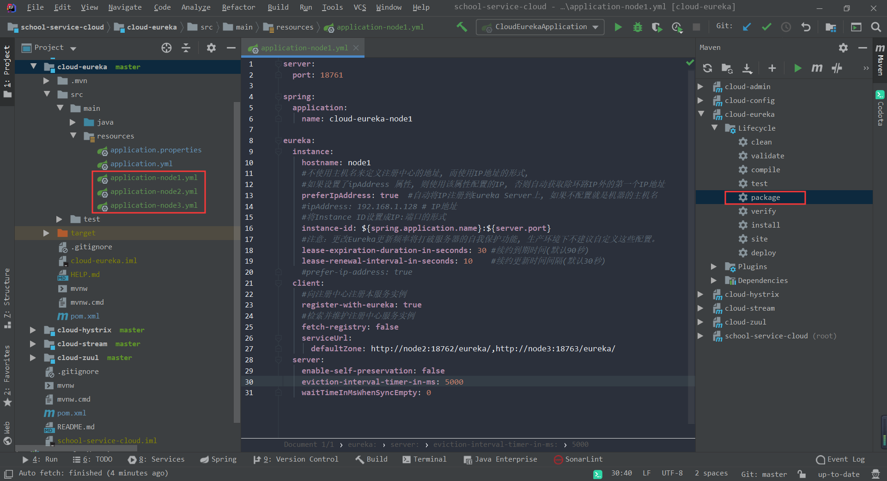
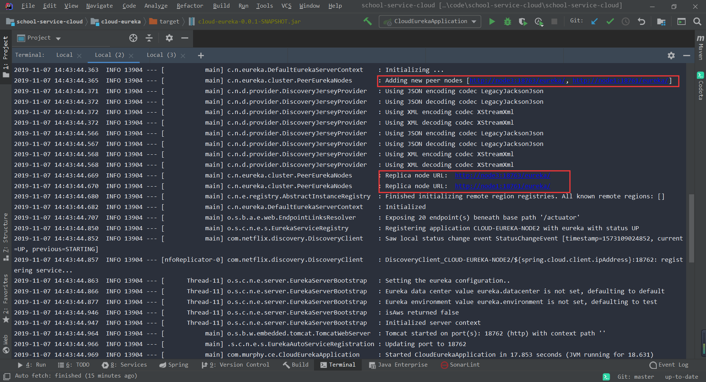
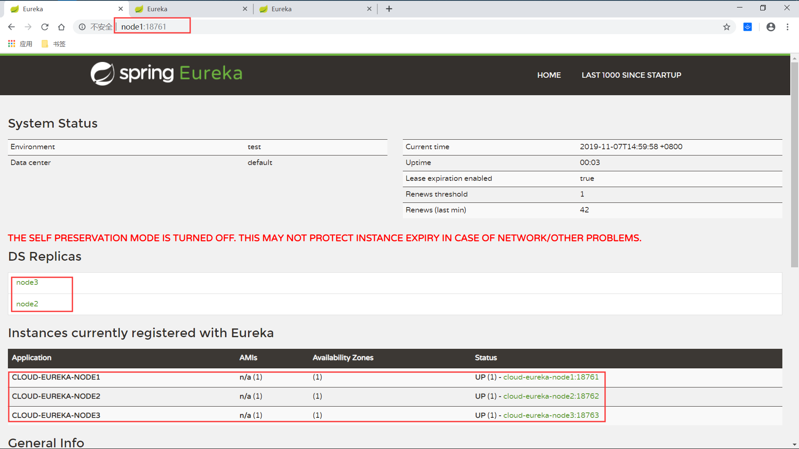
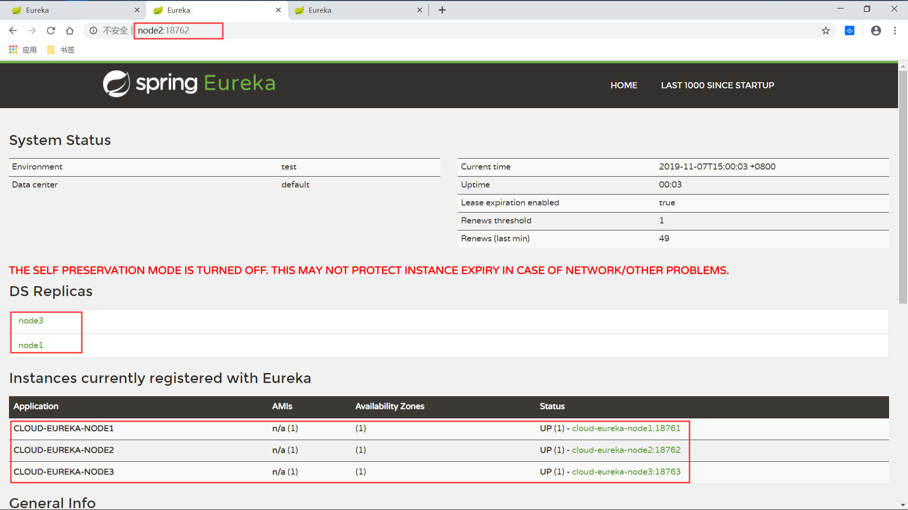
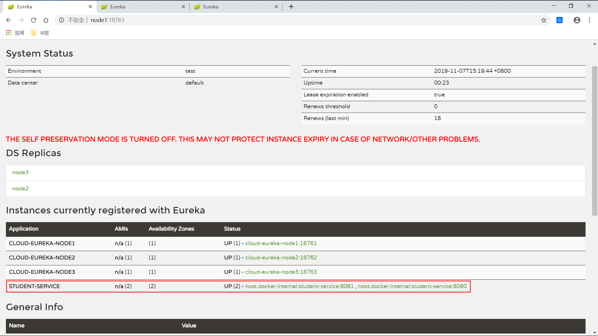

# Spring Cloud-Eureka High-Availability Cluster

 环境信息：     
 OS：Win10     
 JDK：Java8   
 SpringCloud：Greenwich.SR2   
 
## 1 Eureka Server
### 1.1 核心依赖 

```xml

        <dependency>
            <groupId>org.springframework.cloud</groupId>
            <artifactId>spring-cloud-starter-netflix-eureka-server</artifactId>
        </dependency>

```

### 1.2 开启注解 

```java

@SpringBootApplication
@EnableEurekaServer
public class CloudEurekaApplication {

	public static void main(String[] args) {
		SpringApplication.run(CloudEurekaApplication.class, args);
	}

}

```

### 1.3 主要配置 

新建三个配置文件，对应三个Eureka节点：
```yaml
application-node1.yml
application-node2.yml
application-node3.yml
```
三个配置文件配置内容一样，不同的是：
1. 端口：`server.port`
分别修改为三个不同的端口：`18761` `18762` `18763`
2. 名字：`spring.application.name`
分别修改为三个不同的name：`node1` `node2` `node3`
3. 名字：`eureka.instance.hostname`
分别修改为三个不同的域名：`node1` `node2` `node3`
4. 注册地址：`eureka.client.serviceUrl.defaultZone`    
每个节点的注册地址要为其他节点的地址，如node1要配置成node2和node3的地址，已达到相互注册的目的；     
```yaml
eureka:
  client:
    serviceUrl:
      defaultZone: http://node2:18762/eureka/,http://node3:18763/eureka/
```


node1节点服务端完整配置如下，其他节点按照上边的规则进行修改：

```yaml
server:
  port: 18761

spring:
  application:
    name: cloud-eureka-node1

eureka:
  instance:
    hostname: node1
    #不使用主机名来定义注册中心的地址, 而使用IP地址的形式,
    #如果设置了ipAddress 属性, 则使用该属性配置的IP, 否则自动获取除环路IP外的第一个IP地址
    preferIpAddress: true  #自动将IP注册到Eureka Server上, 如果不配置就是机器的主机名
    #ipAddress: 192.168.1.128 # IP地址
    #将Instance ID设置成IP:端口的形式
    instance-id: ${spring.application.name}:${server.port}
    #注意：更改Eureka更新频率将打破服务器的自我保护功能, 生产环境下不建议自定义这些配置。
    lease-expiration-duration-in-seconds: 30 #续约到期时间(默认90秒)
    lease-renewal-interval-in-seconds: 10    #续约更新时间间隔(默认30秒)
    #prefer-ip-address: true
  client:
    #向注册中心注册本服务实例
    register-with-eureka: true
    #检索并维护注册中心服务实例
    fetch-registry: false
    serviceUrl:
      defaultZone: http://node2:18762/eureka/,http://node3:18763/eureka/
  server:
    enable-self-preservation: false
    eviction-interval-timer-in-ms: 5000
    waitTimeInMsWhenSyncEmpty: 0
```
 

### 1.4 Windows配置 
修改host文件，在`C:\Windows\System32\drivers\etc`下   
```yaml
#Eureka DS
127.0.0.1 node1
127.0.0.1 node2
127.0.0.1 node3
```

### 1.5 打包启动
在项目下运行`mvn package`,生成工程jar包；   
然后开启三个终端，分别启动三个节点：   
```shell script
java -jar cloud-eureka-0.0.1-SNAPSHOT.jar --spring.profiles.active=node1
java -jar cloud-eureka-0.0.1-SNAPSHOT.jar --spring.profiles.active=node2
java -jar cloud-eureka-0.0.1-SNAPSHOT.jar --spring.profiles.active=node3
```
前两个节点会有报错，是因为有节点连接超时，都启起来就好了;   
 


### 1.6 Eureka服务端控制台
分别打开：   
```yaml
http://node1:18761
http://node2:18762
http://node3:18763

```

可以看到他们相互进行了注册，`DS Replicas`能够看到其他节点：   
   
 
 
 


*服务端代码：*[https://github.com/WeisonWei/school-service-cloud/tree/master/cloud-eureka](https://github.com/WeisonWei/school-service-cloud/tree/master/cloud-eureka)
## 2 Eureka Client
### 2.1 核心依赖 

```xml

    <dependency>
        <groupId>org.springframework.cloud</groupId>
        <artifactId>spring-cloud-starter-netflix-eureka-client</artifactId>
    </dependency>

```
### 2.2 开启注解 

```java

@SpringBootApplication
@EnableEurekaClient
public class StudentServiceApplication {

    public static void main(String[] args) {
        SpringApplication.run(StudentServiceApplication.class, args);
    }

}

```

### 2.3 主要配置 
跟单节点不同的是注册地址`eureka.client.serviceUrl.defaultZone`，配置多个，其他没有变化：
```yaml
server:
  port: 8080

spring:
  application:
    name: student-service

management:
  endpoints:
    web:
      exposure:
        include: '*'
  endpoint:
    health:
      show-details: always
    shutdown:
      enabled: true

eureka:
  client:
    registry-fetch-interval-seconds: 5
    healthcheck:
      enabled: true
    serviceUrl:
      defaultZone: http://node1:18761/eureka,http://node2:18762/eureka,http://node3:18763/eureka
```

### 2.4 启动服务
以不同端口启动多个服务：

### 2.5 查看控制台服务注册情况
```yaml
http://node1:18761
http://node2:18762
http://node3:18763

```
 



*客户端代码：*[https://github.com/WeisonWei/school-service/tree/master/student-service](https://github.com/WeisonWei/school-service/tree/master/student-service)


