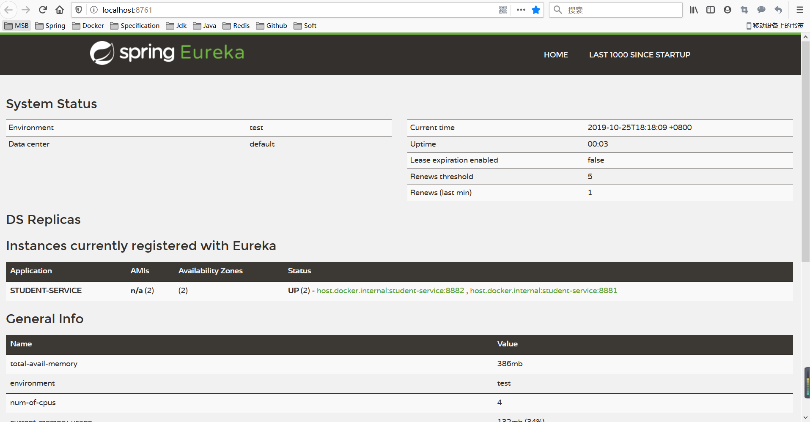
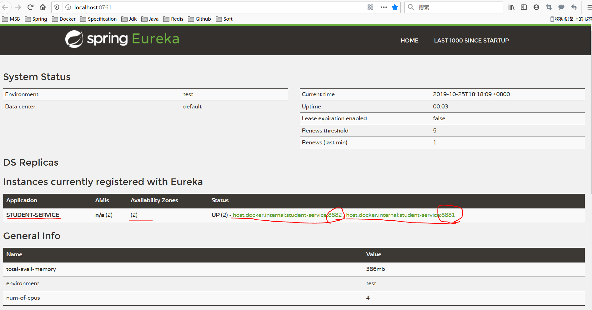

# Eureka 服务注册与发现 -- 单机
 
 环境信息：      
 OS：Win10         
 JDK：Java8      
 SpringCloud：Greenwich.SR2      
 
## 1 Eureka Server
### 1.1 核心依赖 

```xml

        <dependency>
            <groupId>org.springframework.cloud</groupId>
            <artifactId>spring-cloud-starter-netflix-eureka-server</artifactId>
        </dependency>

```

### 1.2 开启注解 

```java

@SpringBootApplication
@EnableEurekaServer
public class CloudEurekaApplication {

	public static void main(String[] args) {
		SpringApplication.run(CloudEurekaApplication.class, args);
	}

}

```

### 1.3 主要配置 

```yaml
server:
  port: 8761

spring:
  application:
    name: cloud-eureka
  cloud:
    config:
      discovery:
        enabled: true

eureka:
  instance:
    hostname: localhost
  client:
    registerWithEureka: false
    fetchRegistry: false
    serviceUrl:
      defaultZone: http://${eureka.instance.hostname}:${server.port}/eureka/
```

### 1.4 Eureka服务端控制台

 > http://localhost:8761    



## 2 Eureka Client
### 2.1 核心依赖 

```xml

        <dependency>
			<groupId>org.springframework.cloud</groupId>
			<artifactId>spring-cloud-starter-netflix-eureka-client</artifactId>
		</dependency>

```
### 2.2 开启注解 

```java

@SpringBootApplication
@EnableEurekaClient
public class StudentServiceApplication {

    public static void main(String[] args) {
        SpringApplication.run(StudentServiceApplication.class, args);
    }

}

```

### 2.3 主要配置 

```yaml
spring:
  application:
    name: student-service

management:
  endpoints:
    web:
      exposure:
        include: '*'
  endpoint:
    health:
      show-details: always
    shutdown:
      enabled: true

eureka:
  client:
    registry-fetch-interval-seconds: 5
    healthcheck:
      enabled: true
    serviceUrl:
      defaultZone: http://localhost:8761/eureka
```

### 2.4 查看控制台服务注册情况
  > http://localhost:8761   
 
 
 
 


